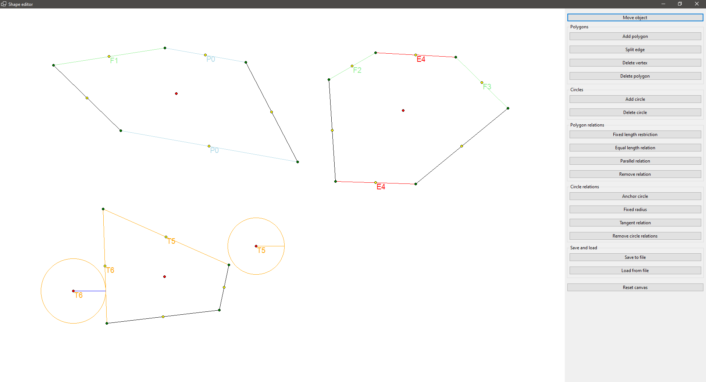

# Polygon drawing app

An application written in C# using Windows Forms with .NET Core, which allows for drawing polygons and circles. Different relations and restrictions for edges and shapes can be added. The application implements the Model View Presenter architectural pattern.

